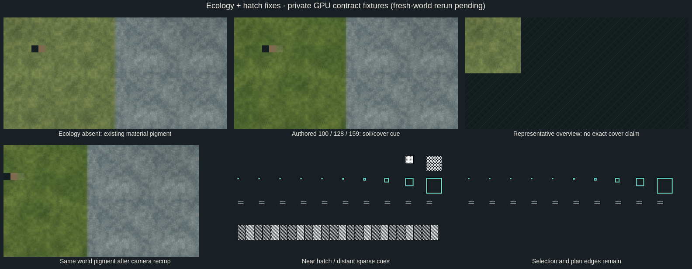

# Fresh-world ecology and distant hatch follow-up

Base: `72a68b5701b05a0914fe543d22649500b8d70d10`, branch `fix/world-art-ecology`, worktree
`/tmp/opencode/continuum-world/art-fixes`.
Source finding: `docs/fresh-world-visual-c557-report.md`, real QA `88110d1`
(integrated as `a74d603`), run9 private-render contact sheet.

## Scoped changes

**Remote detail ecology (P2).** `ColonyMap._ecology_fields` keeps operational
Tile-linked ecology as its first source. Without that row, it requests exactly
`frame_samples(Rect2i(xy, Vector2i.ONE), 1, 1)` in detail. It requires a known
surface and all three finite normalized measurements; pending, unacknowledged,
evicted or incomplete data remains unknown. No neighbouring column is consulted.
Tooltip and placement potential refuse overview/suspended presentation before
making physical queries, including when a Tile row exists under the pointer.

The typed compact fixture reproduces the reported `(512,512)`, cut 15 values:
raw fertility **100**, forest density **128**, moisture **159**. The tooltip shows
fertility **0.39**, density **0.50**, moisture **0.62**, and terrain-only potential
**Farming 74% / Logging 100% / Hunting 100%**. This does not claim actual production
or delivered stock. A distinct neighbouring value and a conflicting operational
Tile row verify exact-point lookup and Tile precedence.

**Ecology artwork.** Optional normalized `soil_fertility`, `forest_density` and
`moisture` fields are validated before every frame-cache reuse and preserved in
the immutable snapshot. Each field is independent; measured zero differs from
absence. The metadata's previously spare blue channel stores three
presence-aware bytes, exactly representable in RGBAF. Pigment quantization error
is at most `1/508`; original numerical data remains exact.

Fertility shifts soil hue, forest density adds darker world-anchored cover
pigment, and moisture adjusts cool/damp shading. Effects apply only inside known
detail soil/turf masks using the centre column's measurements. Stone, known-empty
backing, pending coverage and ecology-less neighbours remain pixel-identical.
These are potential cues, not physical trees, resources, collision or geometry.
Representative overview keeps its existing material styling and inspection gate.

**Tiny excavation hatching (P3).** `MapPaint.hatch` omits dense fill below a
four-pixel minor dimension or three-pixel pitch. Remaining clipped polygons are
checked for valid triangulation before drawing. Plan perimeters, selection and
focused/critical cues have their own drawing paths and remain available at Fit.

## Allocation and integration contract

- No new image, texture sampler, render pass, mask or halo.
- Maximum four-page, 65,536-sample / 32-depth allocation is still
  **9,470,208 bytes**: 8,388,608 RGBA8 mask bytes + 1,081,600 RGBAF metadata bytes.
  Tests count all pages and retained shader TextureRefs, not first-page aliases.
- Identical ecological frame/camera calls retain textures and produce **zero idle
  terrain or mask rebuilds**. Full input validation remains bounded by 65,536
  samples and still occurs on explicit frame submissions.
- The model worker supplies the optional normalized fields from `render_frame`.
  This branch consumes that contract without changing the model or streaming
  code. Typed compact source tests exercise the real `frame_samples` path; shader
  tests supply the future optional frame fields directly. Final connected
  fresh-world visuals depend on that forwarding hook and the planned parent rerun.

## Gates and reproduction

`world_ecology_art_test` covers real generated bindings, acknowledgment/eviction,
exact point lookup, Tile precedence, overview zero-query behavior, strict optional
types/ranges/cache equality, immutable caller isolation, all u8 quantization values,
partial-field presence, all-page budgets and zero idle rebuilds. Its private GL
path compares actual soil/stone/pending/empty/missing-ecology pixels, page seams,
camera crops, unchanged representative overview, and distant/near hatch cues.
Pending hatching is screen-anchored; crop equality compares all resolved pixels.

Final error-scanned gates on this branch:

| Gate | Result |
| --- | --- |
| New ecology/hatch suite | **855 headless / 869 private-GL assertions passed** |
| Existing world art | 2,075 headless / 2,086 private-GL assertions passed |
| Existing R2–R4 art review | 129 headless / 164 private-GL assertions passed |
| Terrain / map-client / feedback | 126 / 1,249 / 42 headless assertions passed |
| Map style | Headless and private GL passed, including asset crop continuity |
| Depth shader / composed occlusion / map-client render | Private GL passed |
| Real generated bindings | Production BSATN roundtrip, arrays, typed indexes/reducers passed |

All listed passing logs have zero script/engine errors; the GL hatch stress test
has **zero triangulation errors**. The overview click test uses the actual
`ColonyMap._gui_input`: it changes to detail without selecting the representative.
Final targeted logs are `headless-world_ecology_art_test.log` and
`gpu-world_ecology_art_test.log`; other gates use the corresponding suite names.

An additional attempted `large_map_wire_test` is **not a passing gate**: its old
pre-binding `ExtendedDb` fixture redeclares `world_generation`,
`terrain_column_chunk` and `terrain_overview_chunk`, which now exist in its parent
generated binding. Godot reports three parse errors; the bounded runner terminated
the scene at 180 seconds. This unchanged fixture is outside this art patch. The
new tests use real bindings instead, including the overview no-pick regression.

Sequential maximum-frame measurements: headless install **950.637ms**, explicit
cache revalidation **584.472ms**; private GL install **981.692ms**, explicit cache
revalidation **582.062ms**. These are worst-size frame-submission CPU measurements,
not idle-frame render times or a streaming performance approval. Idle image/mask
rebuild count is zero; client coalescing/performance work remains with its owner.



```sh
godot --headless --path client/godot --scene res://tools/world_ecology_art_test.tscn
env -u DISPLAY -u WAYLAND_DISPLAY \
  PATH=/tmp/opencode/ux-panels-evidence/usr/bin:$PATH \
  LIBGL_ALWAYS_SOFTWARE=1 LP_NUM_THREADS=4 \
  python3 client/godot/tools/map_client_x11.py \
  --scene res://tools/world_ecology_art_test.tscn
```

Full screenshots, strict error-scanned logs and suite results are under
`client/godot/build/ecology-art/` (ignored). Tests use private Xvfb with Mesa
llvmpipe; timings describe the shared software-rendering host.

## Small UX recommendation

The default cut 0 hides higher landscape surfaces, whereas cut 15 reveals the
generated contours. A future toolbar hint explaining that raising the cut reveals
higher ground would help first-time orientation. State the cut in visual QA
captions. This follow-up leaves cut defaults and physical presentation modes alone.
