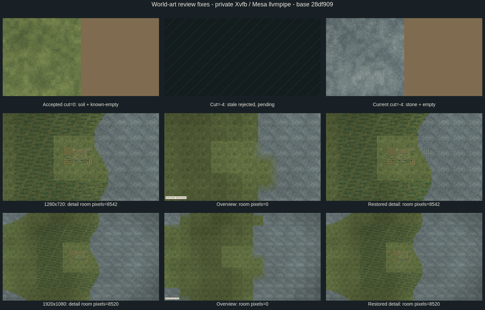

# World-art review fixes (R2–R4)

Base: `28df909c4bbcab696783c536efea644dbfdd2dac`, branch
`fix/world-art-review`, worktree `/tmp/opencode/continuum-world/art-fixes`.
This is a follow-up to art commit `44a313d`; the original art branch and evidence
are preserved. The base supplies RoomOverlay and the new client frame/stream
interfaces. R1's thermal-property correction belongs to `964e1d3` / parent
`aa7abbd` and is not part of this patch.

## Fixes

- **R2:** external room envelopes suppress physical drawing in overview and while
  a frame is suspended. A renderer presentation signal invalidates cached child
  draw commands when detail/overview/pending transitions occur.
- **R3:** every incoming frame is validated before cache reuse. Samples require
  actual boolean/integer fields, registered opaque nonzero materials in the cut's
  height range, or registered nonopaque air at the exact known-empty sentinel.
  Contradictory pending data and overflowing coverage budgets are rejected.
  Accepted snapshots retain only recursively read-only primitive render data;
  caller mutation cannot alter them. Identical validated cache hits reuse images.
- **R4:** incompatible model/cut contexts suspend accepted frames. All pages,
  shader metadata bindings, terrain/entity masks, entity descriptors and active
  passes release their old data immediately. Pending coverage remains until a
  current valid frame arrives. Map overlays and external rooms redraw accordingly.

Overview remains representative-only: validation, rendering and room guards make
zero exact-geometry queries in the dedicated overview tests.

## Private-render verification

Godot 4.7.2, GL Compatibility, Mesa 26.2.4 llvmpipe, four rendering threads,
isolated Xvfb. Full captures and logs:
`client/godot/build/art-review-fixes/` (ignored).

- New regression suite: **129 headless / 164 GPU assertions passed**.
- Original independent probes, copied unchanged from the review's ignored build
  directory: `frame_adversarial` (28), `invalid_frame_gpu`, `integration_gpu` (16)
  all pass. Their outputs are under `client/godot/build/review-art/`.
- Room pixel differences against the same hidden overlay:

  | Resolution | Detail | Overview | Restored detail |
  | --- | ---: | ---: | ---: |
  | 1280×720 | 8,542 | **0** | 8,542 |
  | 1920×1080 | 8,520 | **0** | 8,520 |

- Actual GPU old-frame → cut → rejected stale frame pixels exactly match an
  independently rendered clean pending baseline, before and after layout/show.
  Current-cut stone replaces old-cut soil. A separate detail test verifies real
  whole-entity pixels/masks disappear and restore with fresh descriptors.
- Maximum 65,536-sample, four-page, 32-depth fixture: masks **8,388,608 bytes**;
  metadata including all halos **1,081,600 bytes**; total **9,470,208 bytes**.
  Measurement follows all page fields **and shader TextureRefs**. Narrowing the
  camera releases inactive metadata; suspension releases every counted image.
  Repeated identical frame/camera states produce **zero idle rebuilds**.



## Combined-client dependency

On the requested base plus these fixes, existing headless art (2,075), terrain
(126), map-client (1,249), feedback (42) and style tests pass. GPU depth-shader,
composed-occlusion, style/crop-continuity and map-client render suites also pass.

The existing GPU `world_art_test` still fails three assertions at its standalone
legacy renderer path: initial opaque coverage, page reconstruction, and same-plane
material separation. This reproduces the parent's separately reported lazy-model
P1: `model.rebuild()` clears the surface cache and legacy `view.rebuild()` indexes
it before lazy resolution. The map-client worker owns that fix. No legacy test
assertion has been relaxed or made to accept blank terrain. The final combined
GPU rerun requires that worker's fix commit; this report does not approve that
pending integration.

Only the frame renderer, public map visual guards, room rendering, art tests and
art documentation change here. In a cherry-pick conflict, retain the worker's
bounded legacy `rebuild` / `_index_surfaces` changes alongside this patch's frame
validation and suspension paths.

## Reproduce

```sh
godot --headless --path client/godot --scene res://tools/world_art_review_test.tscn
env -u DISPLAY -u WAYLAND_DISPLAY \
  PATH=/tmp/opencode/ux-panels-evidence/usr/bin:$PATH \
  LIBGL_ALWAYS_SOFTWARE=1 LP_NUM_THREADS=4 \
  python3 client/godot/tools/map_client_x11.py \
  --scene res://tools/world_art_review_test.tscn
```

After integrating the map-client fix, also rerun `world_art_test.tscn` headless
and through the private GL runner, plus `terrain_render_test.tscn`,
`terrain_composed_test.tscn`, `map_style_render_test.tscn`, and
`map_client_render_test.tscn` through the private runner.
